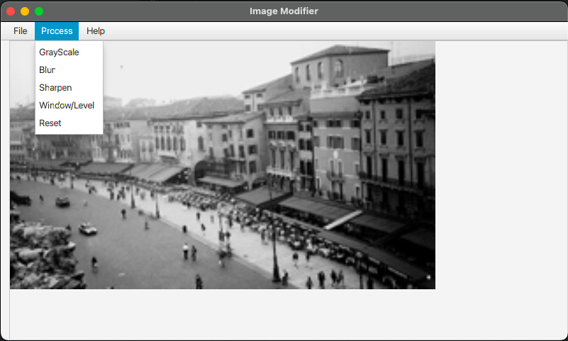
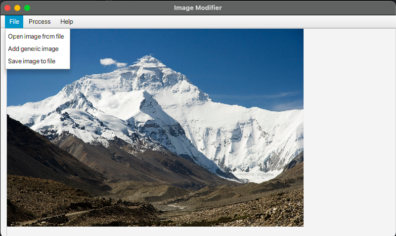
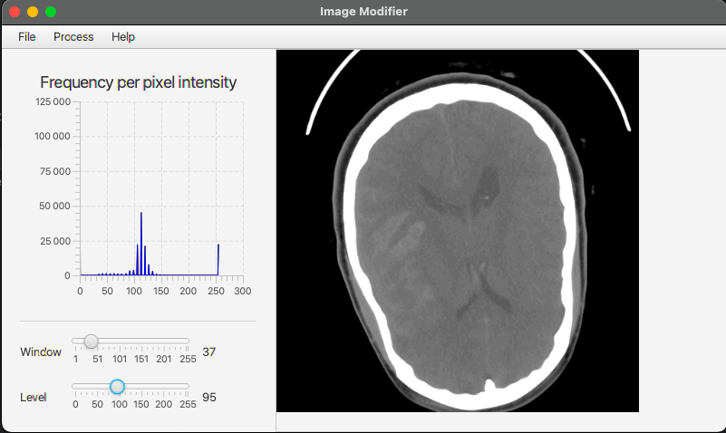

# Image Processor (JavaFX – MVC)

A desktop application for basic image processing, developed as part of the HI1027 course at KTH Royal Institute of Technology.  
The project demonstrates Model–View–Controller (MVC) design, event handling, and JavaFX integration for user-driven image manipulation.

---

## Features

- Load and display images using JavaFX FileChooser
- Grayscale conversion – transforms the image to black and white
- Blur filter – applies a weighted 3×3 blur kernel
- Sharpening filter – enhances edges using blur subtraction
- Window/Level contrast adjustment – interactive contrast control using sliders
- Histogram visualization – displays pixel intensity distribution for RGB channels
- Save modified images to file
- Revert to original image with one click

---

## Architecture

This project follows the Model–View–Controller (MVC) pattern:

| Component | Responsibility |
|------------|----------------|
| **Model** | Handles image data, pixel matrices, and processing algorithms |
| **Controller** | Connects user actions to model operations |
| **View** | JavaFX interface for menu, sliders, and image display |

The model exposes a simple interface (`IPixelProcessor`) allowing new image filters to be added with minimal code changes.

---

## Technologies Used

- JavaFX for GUI
- Java 21+
- Object-oriented design (MVC, interface abstraction)
- HistogramView custom component (for displaying pixel intensity graphs)

---

## Screenshots

| Blur Filter                                 | File Menu                                     | Histogram                                      |
|---------------------------------------------|-----------------------------------------------|------------------------------------------------|
|  |  |  |

---

## How to Run

1. Clone the repository:
   ```bash
   git clone https://github.com/TyroneAsantee/ImageProcessor.git
2. Open the project in IntelliJ IDEA (or another JavaFX-compatible IDE).

3. Make sure JavaFX SDK is configured in your module settings.

4. Run Main.java.

---

## Authors
Tyrone Asante
KTH Royal Institute of Technology – Course: HI1027 Object-Oriented Programming

Nitin Kumar
KTH Royal Institute of Technology – Course: HI1027 Object-Oriented Programming